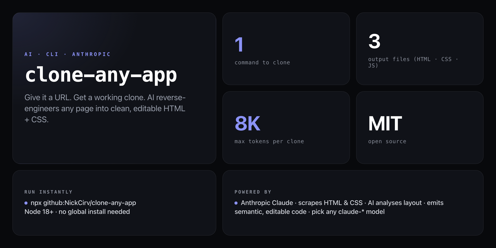

<div align="center">

**Point it at any URL. Get a working, editable clone in seconds — powered by Claude.**


</div>

---

You see a sharp landing page. You want something like it. Normally that means hours in DevTools — copying snippets, guessing fonts, rebuilding spacing from scratch. `clone-any-app` skips all of that: it fetches the page, sends the HTML and CSS to Claude, and generates clean semantic code you can open, edit, and ship.

```
$ npx github:NickCirv/clone-any-app https://stripe.com/pricing

  clone-any-app v1.0.0
  ─────────────────────────────────
  Target:  https://stripe.com/pricing
  Output:  /home/you/stripe-clone
  Model:   claude-opus-4-5

  ✔ Scraped — Stripe Pricing · 84.2KB HTML · 31.6KB CSS · 12 images
  ✔ AI clone generated — 19.4KB response
  ✔ Wrote 3 files to /home/you/stripe-clone

  Clone complete!

  ✓ index.html
  ✓ styles.css
  ✓ script.js

  Preview:
  open stripe-clone/index.html
  or npx serve stripe-clone
```

## Install

No global install needed — run straight from GitHub:

```bash
export ANTHROPIC_API_KEY=sk-ant-...

npx github:NickCirv/clone-any-app <url>
```

## Usage

```bash
# Clone a page into a default output dir (<hostname>-clone/)
npx github:NickCirv/clone-any-app https://linear.app

# Specify a custom output directory
npx github:NickCirv/clone-any-app https://vercel.com --output ./my-clone

# Use a different Anthropic model
npx github:NickCirv/clone-any-app https://stripe.com/pricing --model claude-opus-4-5
```

| Flag | Description |
|------|-------------|
| `<url>` | URL of the page to clone (required) |
| `-o, --output <dir>` | Output directory (default: `<hostname>-clone`) |
| `-m, --model <model>` | Anthropic model to use (default: `claude-opus-4-5`) |
| `-V, --version` | Show version |
| `-h, --help` | Show help |

## How it works

1. **Scrape** — fetches the target page's HTML, CSS, and image metadata
2. **Analyse** — Claude reads the visual structure, layout, colour palette, and typography
3. **Generate** — outputs clean, semantic `index.html`, `styles.css`, and `script.js`
4. **Write** — files land in the output directory, ready to open or edit

The clone is a starting point — not a pixel-perfect copy. It captures the design intent: layout structure, spacing rhythm, colour system, and component patterns.

## Requirements

- Node.js 18+
- `ANTHROPIC_API_KEY` environment variable set to a valid `sk-ant-…` key

## What it is NOT

- **Not a pixel-perfect screenshot replica.** It regenerates clean code from structure analysis — dynamic or JS-heavy apps may produce partial results.
- **Not a copyright circumvention tool.** Use it to learn, to prototype, or to create inspired-by work — not to copy proprietary designs for commercial use.
- **Not a scraper for SPAs.** Pages that require login or heavy client-side rendering will give it less to work with; treat the output as a structural starting point.

## See Also

- [one-prompt-saas](https://github.com/NickCirv/one-prompt-saas) — Full SaaS from one prompt
- [zero-to-prod](https://github.com/NickCirv/zero-to-prod) — Empty dir to deployed app speedrun
- [readme-surgeon](https://github.com/NickCirv/readme-surgeon) — Upgrade any README with AI

---

<div align="center">
<sub>Node 18+ · MIT · by <a href="https://github.com/NickCirv">NickCirv</a></sub>
</div>
