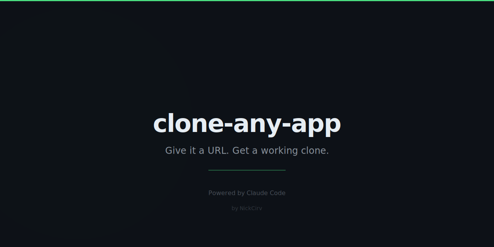

# clone-any-app

> Give it a URL. Get a working clone.

Point it at any website. It scrapes the structure, feeds it to AI, and generates a clean, working clone in seconds.

## Quick Start

```bash
# Clone any website
npx clone-any-app https://stripe.com/pricing

# Specify output directory
npx clone-any-app https://linear.app --output ./my-clone
```

## What You Get

```
stripe-clone/
├── index.html    # Clean semantic HTML
├── styles.css    # Matching visual styles
└── script.js     # Interactivity
```

Open `index.html` in your browser — it looks like the original.

## How It Works

1. Fetches the target URL's HTML and CSS
2. AI analyzes the visual structure and design
3. Generates clean, modern code that recreates the look
4. Writes files you can edit, deploy, or learn from

## Options

```
clone-any-app <url> [options]

Options:
  -o, --output <dir>    Output directory (default: <hostname>-clone)
  -m, --model <model>   Anthropic model to use (default: claude-opus-4-5)
  -V, --version         Show version
  -h, --help            Show help
```

## Limitations

- Works best on marketing/landing pages
- Complex web apps (React SPAs) may not clone perfectly
- Uses placeholder images
- No backend functionality (frontend only)

## Use Cases

- **Learning:** See how sites are built by studying the clone
- **Prototyping:** Quick starting point for similar designs
- **Inspiration:** Remix and build on top of existing designs

## Requirements

- Node.js 18+
- `ANTHROPIC_API_KEY` environment variable

```bash
export ANTHROPIC_API_KEY=sk-ant-...
```

## Related

- [zero-to-prod](https://github.com/NickCirv/zero-to-prod) — Empty dir to deployed app speedrun
- [one-prompt-saas](https://github.com/NickCirv/one-prompt-saas) — Full SaaS from one prompt

## License

MIT — NickCirv
